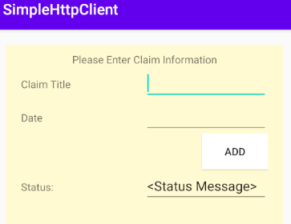
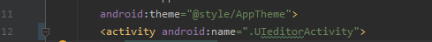

# HTTP Server - Koitlin
## Intro to Android Development - Basic UI

## Using View programming API
## 
1. Status Message Displays success or failure message\

2. The screen refreshes after message is uploaded to server or if there is an error code

## Using Android Studio xml Editor (Drag and Drop)
 - This method was much faster\

# How to Run
 - To switch between different views follow these steps
 1. Navigate to androidmanifest.xml\
 
 2. On line 12 change Activity to be either CustomActivity or UieditorActivity

