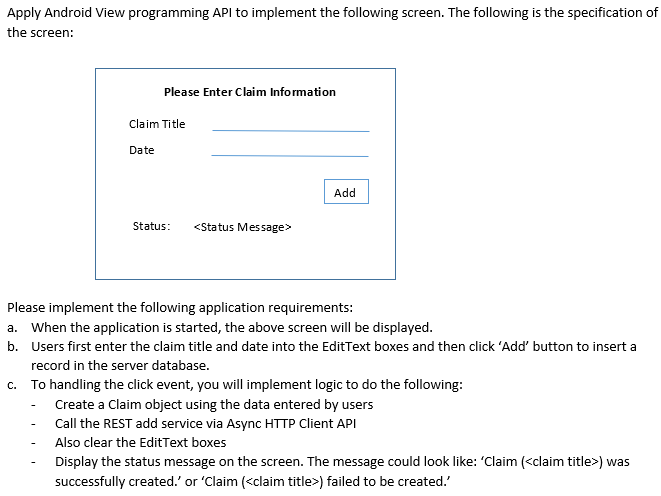
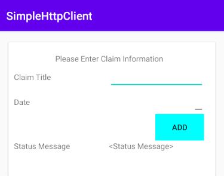
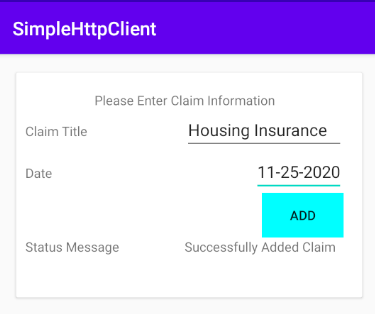

# HTTP Server - Koitlin
## Intro to Android Development - Basic UI

## Features
## 
1. Status Message Displays success or failure message\

2. The screen refreshes after message is uploaded to server or if there is an error code
