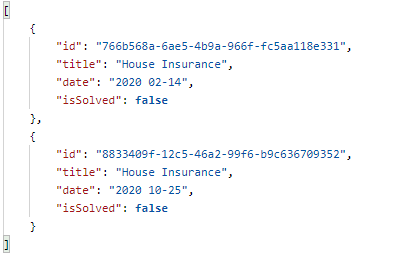

# HTTP Server - Koitlin
## Intro to Android Development - Homework 1 

### **HTTP ENDPOINTS**

### **Example Post Request**
*  `http://0.0.0.0:8080/ClaimService/add `
* Body of Request: `{"title" : "House Insurance", "date" : "2020 02-14"}`
* UUID & isSolved are generated programatically
### **Example GET Request**
* `http://0.0.0.0:8080/ClaimService/getAll`\

## Running Code
## 
1. Open this folder in Intellij
2. Set Configuration with main calss as com.example.Aplication.kt also set root folder to 411-homework.main 
3. Run Server

